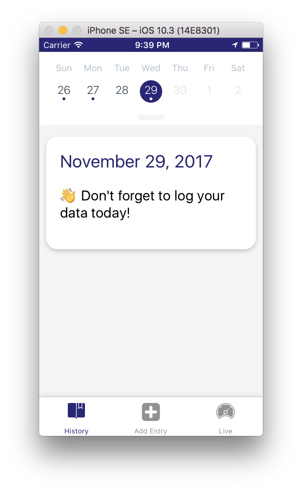

UdaciFitness
===

An activity logging app to demonstrate react-native capabilities including location, permissions, notifications and async redux.

## Usage

```
git clone git@github.com:drewsmith/UdaciFitness.git
yarn install
yarn start
```

react-native uses https://expo.io/ to emulate smartphone devices.


